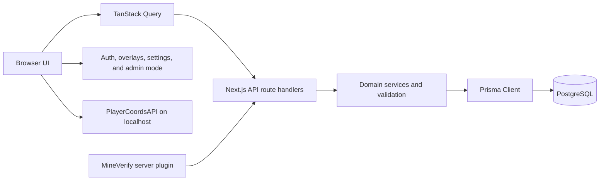

# Application Architecture

PMC Plan is a Next.js App Router application centered on a single interactive
map. Browser components consume lightweight HTTP projections, while API route
handlers delegate authorization, validation, domain behavior, and persistence
to focused modules under `lib/`.

## Runtime Overview

The browser never connects directly to PostgreSQL. Route handlers are the HTTP
boundary; Prisma queries and mutations belong in server-only domain modules.

## Application Layers

### `app/`: HTTP and Page Boundaries

- `app/page.tsx` composes the map, destination and position panels, settings,
  itinerary controls, and top-level overlays.
- `app/layout.tsx` defines metadata, fonts, analytics, and the global provider
  tree.
- `app/api/**/route.ts` parses HTTP input and returns public response shapes.
  Route handlers should remain thin and delegate reusable behavior to `lib/`.
- global styles and shared animations remain under `app/`.

### `components/`: User Interface

Components are grouped by feature, including `map/`, `destination/`, `form/`,
`market/`, `overlay/`, `settings/`, `spaces/`, and `trade/`. Generic controls
live in `components/ui/`.

Shared overlay frames, form fields, buttons, selectors, empty states, and list
rows must be reused instead of recreated per domain. Theme values come from
`lib/theme-colors.ts`; light and dark behavior must be changed together.

### `lib/`: Domain and Infrastructure

Feature directories contain validation, serialization, permissions, queries,
mutations, and client helpers. Important cross-cutting areas include:

- `lib/auth/` and `lib/admin/` for identity, roles, and effective admin mode;
- `lib/map-content/` for the lightweight map projection and progressive detail;
- `lib/query/` for query keys and targeted invalidation;
- `lib/map/`, `lib/nether/`, and `lib/route-planning/` for map metadata and
  itinerary calculation;
- `lib/content-management/` and `lib/map-entry/` for shared ownership,
  management, and content-list behavior;
- `lib/mineverify/` and Minecraft-related modules for external integrations;
- `lib/prisma.ts` and `lib/prisma/` for the server database boundary.

Code shared by API routes and components must expose explicit public types and
avoid importing server-only modules into client bundles.

### `prisma/`: Persistence

`prisma/schema.prisma` is the source of truth for the PostgreSQL model. Every
schema change requires a committed migration under `prisma/migrations/`.
Local Prisma commands pass through a hostname and database-name guard. The
development database is always `pmc_plan_dev` on localhost.
Its initial data comes from a private, production-derived snapshot downloaded
to `.local/database/`; the archive is never committed or consumed by CI.

## Provider Tree and UI State

`components/Providers.tsx` installs the global providers in dependency order:

1. TanStack Query owns remote server state and request deduplication.
2. Auth.js exposes the Discord session.
3. the admin-mode provider derives the effective preview role.
4. overlay stack providers coordinate transitions and breadcrumbs.
5. settings and content overlay providers expose domain-specific actions.

Local component state is appropriate for ephemeral UI state such as the active
map world or selected itinerary segment. Data returned by APIs belongs in
TanStack Query so overlays and panels share one cache.

## Data Loading

Startup loads `/api/map-content`, a lightweight projection containing only the
fields required by the map and destination panel. Full images, offers,
ownership, management, and audit data are loaded when an overlay opens.

Marketplace, services, spaces, account content, and administration views use
paginated projections. Mutations invalidate domain query keys through the
shared helpers in `lib/query/` and revalidate server cache tags. Do not add a
second complete client-side copy of public content.

Database-backed server caches use the shared helper in `lib/cache/`. It bypasses
persistent caching in development and scopes production keys and invalidation
tags to an opaque database identity. Mutation invalidations expire matching
entries immediately so the next read cannot serve stale content. Database
queries must not call `unstable_cache` or `revalidateTag` directly.

See [Public Data Loading](api/data-loading.md) for request contracts, cache
durations, and invalidation rules.

## Domain Model

`MapEntry` is the shared management aggregate for a place, a linked portal pair,
or a service. It carries the primary manager, additional managers, Minecraft
owners, canonical color, ordered image gallery, optional space association,
audit editor, and timestamps.

- a `Place` adds one world position, presentation fields, tags, and
  trade offers;
- linked `Portal` records share one `MapEntry`, including its gallery, while
  retaining one coordinate set per world;
- a `Service` adds its presentation, contact mode, and payment information;
- a `Space` has its own managers and groups map entries;
- `User` represents the Discord account used for authentication and management;
- `MinecraftProfile` represents the optional verified in-game identity used for
  ownership presentation.

Trade offers and their items belong to places. Temporary MineVerify requests
exist only for the account-linking lifecycle.

## Authentication and Authorization

Auth.js uses Discord OAuth with the `identify` scope. A successful sign-in
synchronizes the Discord ID, username, display name, and avatar into `User`.
Roles are stored in PostgreSQL as `pending`, `user`, `admin`, or `super_admin`.

The debug mode changes only the effective role used to preview the interface;
it never grants permissions beyond the authenticated account's stored role.
Server mutations must always enforce authorization independently of visible UI
controls.

Local development uses the same OAuth flow. After each snapshot restoration, a
local bootstrap assigns Super Admin only inside the isolated database to the
account identified by `DEV_DISCORD_ID`.

## Maps and Routing

Each world has metadata, an overview image, and high-resolution tiles under
`public/`. Map layers convert Minecraft coordinates into image positions and
limit detailed rendering to the visible viewport.

Itinerary calculation lives behind `/api/route`. Cross-world routes select
linked portals, and Nether segments can prefer the configured fast-axis graph.
Rendering the resulting path remains a frontend responsibility.

See [Map Image Format](MAP_IMAGE_FORMAT.md) for asset generation and coordinate
rules, and [Backend API](BACKEND_API.md) for itinerary contracts.

## Adding or Changing a Feature

1. Identify the existing domain and shared UI primitives before creating files.
2. Update validation and domain services before the route or component layer.
3. Keep API projections minimal and define stable public response types.
4. Invalidate only the affected query families and server cache tags.
5. Add tests at the lowest useful boundary, then run `npm run check:quality`.
6. Update the relevant API or architecture documentation.

Database changes additionally require `npm run db:migrate -- --name <name>` and
the generated migration directory. Production deployment follows
[Database Deployment](DATABASE_DEPLOYMENT.md).
